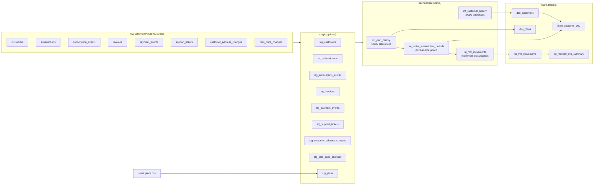

# SaaS Billing Analytics Pipeline

An end-to-end data engineering project that turns raw SaaS subscription and billing
data into revenue analytics: including **MRR movement analysis (new / expansion / contraction /
churn / reactivation)**, point-in-time pricing, SCD2 history, and a customer-360 mart.

Built with **dbt (PostgreSQL)** for transformation, **Apache Airflow** for orchestration
and **Docker** for a reproducible local environment.


---

## Table of contents

- [What this project does](#what-this-project-does)
- [Architecture](#architecture)
- [Tech stack](#tech-stack)
- [Data model](#data-model)
- [Data quality & tests](#data-quality--tests)
- [Getting started](#getting-started)
- [Running dbt](#running-dbt)
- [Running Airflow](#running-airflow)
- [Environment variables](#environment-variables)
- [Key modelling decisions](#key-modelling-decisions)
- [Known limitations / roadmap](#known-limitations--roadmap)
- [Author](#author)

---

## What this project does

A fictional SaaS company sells monthly and annual subscription plans and wants to answer questions such as:

- How much **new MRR** was added this month and how much came from **expansion**, **contraction**, **churn** and **reactivation**?
- What is each customer's **current MRR**, total invoiced, amount collected and outstanding balance?
- How has a plan's **price changed over time** and which price was in effect when a subscription event occurred ?
- What does the **customer 360 view** look like across billing, current MRR and support activity ?

The pipeline ingests 8 raw source tables, cleans and standardizes them in a staging layer,
applies history and point-in-time logic in an intermediate layer, and produces analytics-ready
dimension and fact models in the marts layer.

---

## Architecture



**Orchestration:** Airflow DAG `dbt_saas_billing` runs `dbt run` → `dbt test` inside a
Dockerized Airflow (Celery executor) that mounts the dbt project and connects to Postgres.

---

## Tech stack

| Layer | Tool |
|---|---|
| Transformation | dbt-core 1.12, dbt-postgres, dbt_utils |
| Warehouse | PostgreSQL 16 |
| Orchestration | Apache Airflow 3.2 (Celery executor, Docker Compose) |
| Packaging | `uv` (Python 3.11) |
| Containerization | Docker / Docker Compose |

---

## Data model

### Sources (raw)
Defined in [`models/staging/_staging__sources.yml`](saas_billing/models/staging/_staging__sources.yml):
`customers`, `subscription_events`, `customer_address_changes`, `plan_price_changes`,
`subscriptions`, `invoices`, `payment_events`, `support_tickets`.

### Staging (views) — clean & conform
One model per source (`stg_*`): trimming/lowering strings, casting types, no business logic.
`stg_plans` is built from the `plans` **seed** rather than a raw table.

### Intermediate (views) — history & point-in-time logic
| Model | Purpose |
|---|---|
| `int_plan_history` | SCD2 history of **plan prices** — one row per price version, with `valid_from` / `valid_to` / `is_current`. |
| `int_customer_history` | SCD2 history of **customer addresses** — one row per address version. |
| `int_active_subscription_periods` | Active subscription periods, **priced at the plan price valid at that moment** (as-of join against `int_plan_history`). Annual plans are normalised to monthly MRR (`price / 12`). |
| `int_mrr_movements` | One row per MRR-changing event per subscription, classified as `new`, `expansion`, `contraction`, `churn`, `reactivation`, `no_change`. |

### Marts (tables) — analytics-ready
| Model | Grain | Purpose |
|---|---|---|
| `dim_customers` | 1 row / customer | Customer attributes + current address. |
| `dim_plans` | 1 row / plan | Current plan price and billing interval. |
| `fct_mrr_movements` | 1 row / MRR event | Movement fact with previous/new MRR and delta. |
| `fct_monthly_mrr_summary` | month × movement_type | MRR movement summary (subscriptions affected, total delta). |
| `mart_customer_360` | 1 row / customer | Denormalised current MRR + invoiced/paid/outstanding + support activity. |

### Seeds
`seeds/plans.csv` — the 6 product plans (3 tiers × monthly/annual).

---

## Data quality & tests

- **Generic tests** in YAML: `unique`, `not_null`, `accepted_values` and `relationships`
  across staging, intermediate and marts.
- **dbt_utils** tests: `expression_is_true`, `unique_combination_of_columns`.
- **Singular tests**: `tests/assert_mrr_never_negative.sql` asserts that no MRR value is negative.

Run the full dbt workflow with:

```bash
dbt build      
```

---

## Getting started

### Prerequisites

- Python **3.11** (see `.python-version`)
- [`uv`]
- Docker Desktop (for Airflow)
- PostgreSQL 16 with a database named `saas_billing`

### 1. Install dependencies

```bash
uv sync
```

### 2. Configure PostgreSQL

Create the `saas_billing` database and load the required raw tables into the `public` schema:

`customers`
`subscriptions`
`subscription_events`
`invoices`
`payment_events`
`support_tickets`
`customer_address_changes`
`plan_price_changes`

> Raw data loading is **not automated in this repository**

### 3. Configure the dbt profile

Set the PostgreSQL connection details as environment variables:

```bash
export DBT_POSTGRES_HOST=localhost
export DBT_POSTGRES_USER=postgres
export DBT_POSTGRES_PASSWORD=postgres
export DBT_POSTGRES_DB=saas_billing
```

---

## Running dbt

From the `saas_billing/` directory:

```bash
cd saas_billing
dbt deps        
dbt seed        
dbt build
```
`dbt build` builds the models and runs the associated tests.

For a specific model or layer:

```bash
dbt run --select staging        
dbt run --select +fct_mrr_movements   
```

Generate and serve dbt documentation:

```bash
dbt docs generate
dbt docs serve
```

---

## Running Airflow

From the `airflow/` directory
```bash
cd airflow        
docker compose up -d --build
```

The `dbt_saas_billing` DAG runs:
```bash
dbt run → dbt test
```

The DAG is currently configured for manual execution (`schedule=None`).

To stop Airflow:
```bash
docker compose down
```

---

## Environment variables

| Variable | Used by | Description |
|---|---|---|
| `DBT_POSTGRES_HOST` | dbt profile | Postgres host |
| `DBT_POSTGRES_USER` | dbt profile | Postgres user |
| `DBT_POSTGRES_PASSWORD` | dbt profile | Postgres password |
| `DBT_POSTGRES_DB` | dbt profile | Database name (`saas_billing`) |
| `AIRFLOW_UID` | docker-compose | UID for mounted files (Linux only) |


---

## Key modelling decisions

- **Point-in-time pricing instead of today's price.** `int_active_subscription_periods`
  joins each subscription event to the plan-price version that was valid *at that instant*
  (`valid_from <= event < valid_to`). This prevents historical MRR from changing when a plan's price changes later.
- **Hand-rolled SCD2 in intermediate models.** `int_plan_history` and `int_customer_history`
  build `valid_from`/`valid_to`/`is_current` versions with window functions
  (`lead`, `row_number`), so marts can answer historical "as of" questions.
- **Annual → monthly normalisation.** Annual plan prices are divided by 12 so all MRR figures use a consistent monthly basis.
- **Movement classification by source event first.** `int_mrr_movements` uses the source event type when it is unambiguous (`created` → new, `canceled` → churn, etc) and uses the MRR delta to distinguish expansion from contraction for price changes.
- **Layered materialisation.** Staging and intermediate models are materialised as views,
while marts are materialised as tables for analytics and query performance.

---

## Known limitations / roadmap

The current project is designed as a local portfolio implementation. Potential next steps include:

- **Automate the raw-data load.** The raw source tables currently need to be loaded separately before running dbt.

- **Schedule the DAG.** The DAG currently uses `schedule=None` and is triggered manually.

- **Evaluate dbt snapshots.** Use dbt snapshots where appropriate for historical models.

- **Add source freshness checks** and a `dim_date` calendar model.

- **Introduce incremental fact models** as data volume grows.

---

## Author

Minal Urooj